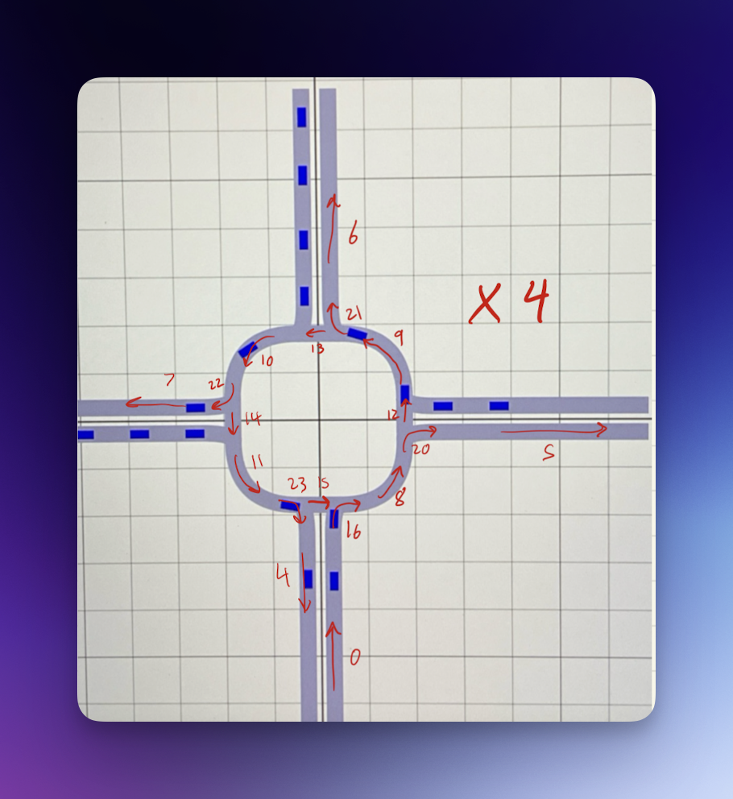
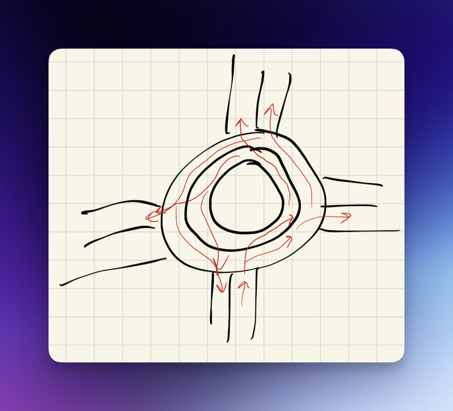
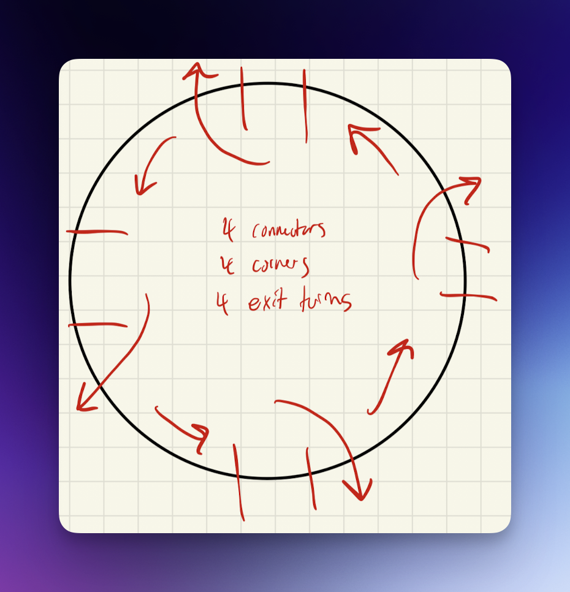
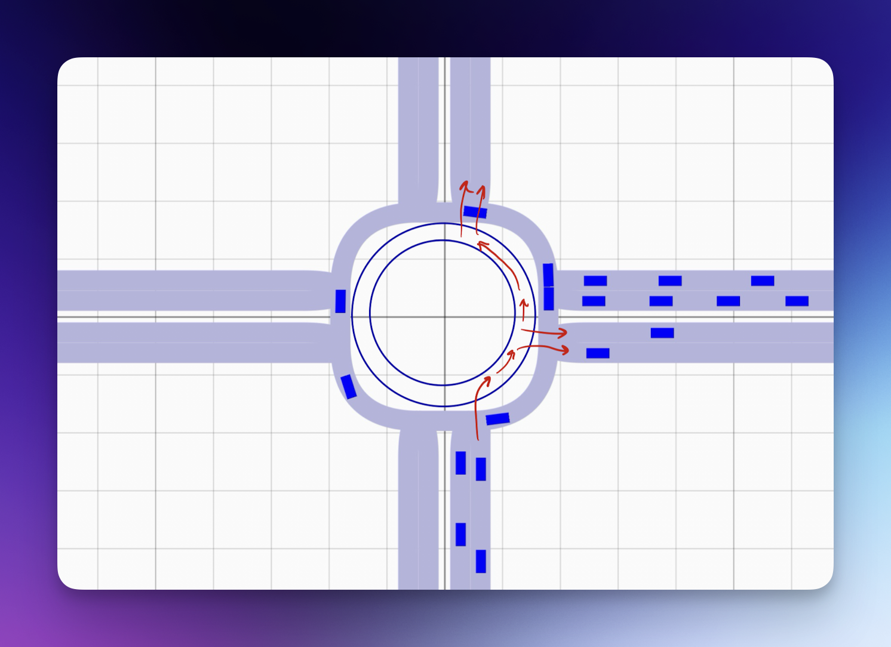
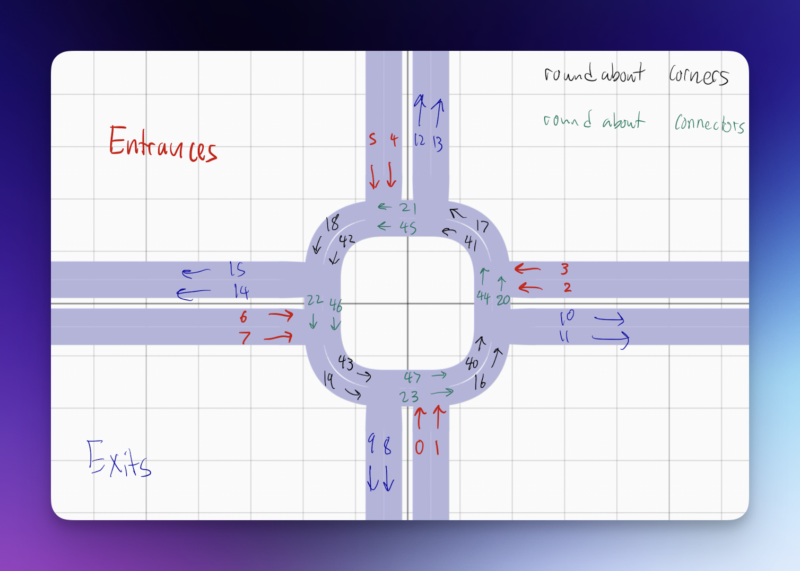
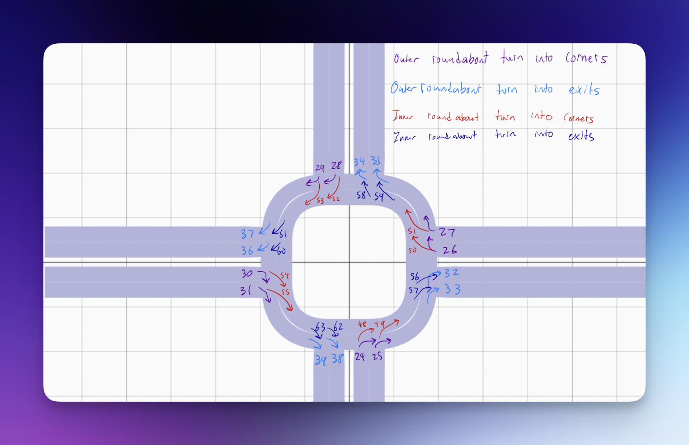

# How we made our prototype design

First we analyzed the given roundabout code and traced the movement paths of the cars while making note of the segment numbers.

Next we started to design our intersection with our main objective in mind of reduction traffic congestion.

From there we started with expanding the number of lanes for entry and exit to allow for more cars. Then we started to work on making the roundabout have 2 lanes.

Finally we had everything done and labeled each segment with its number so someone else can do the rest of the work (like vehicle generating)

