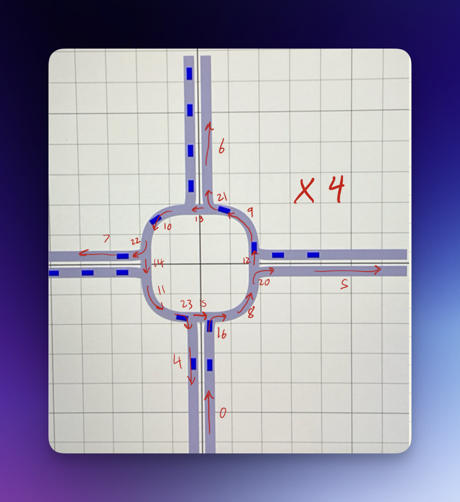
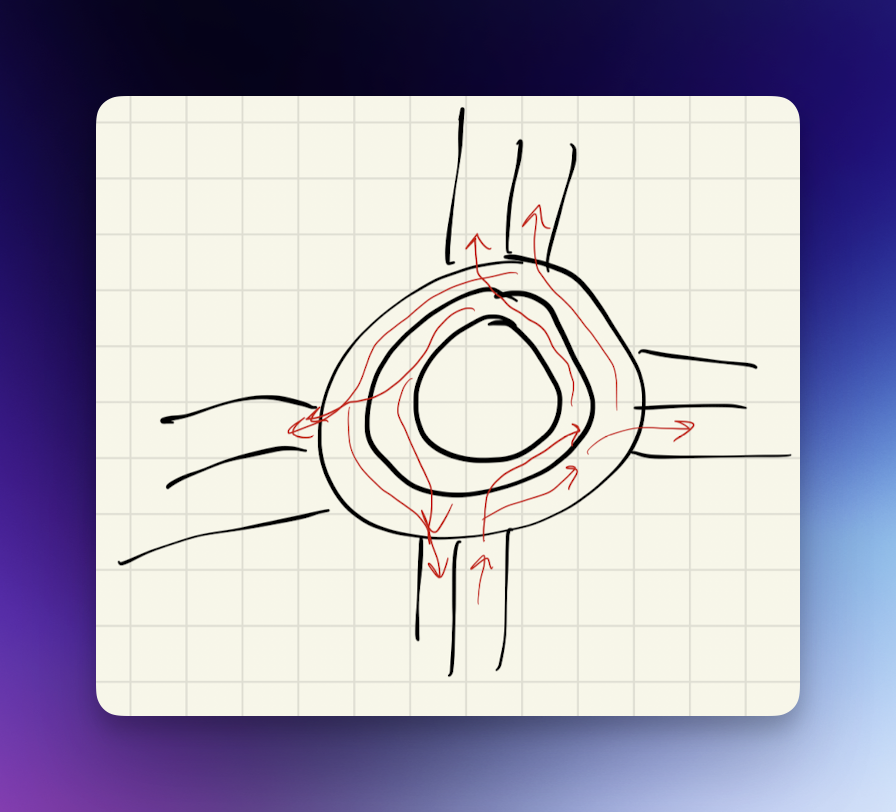
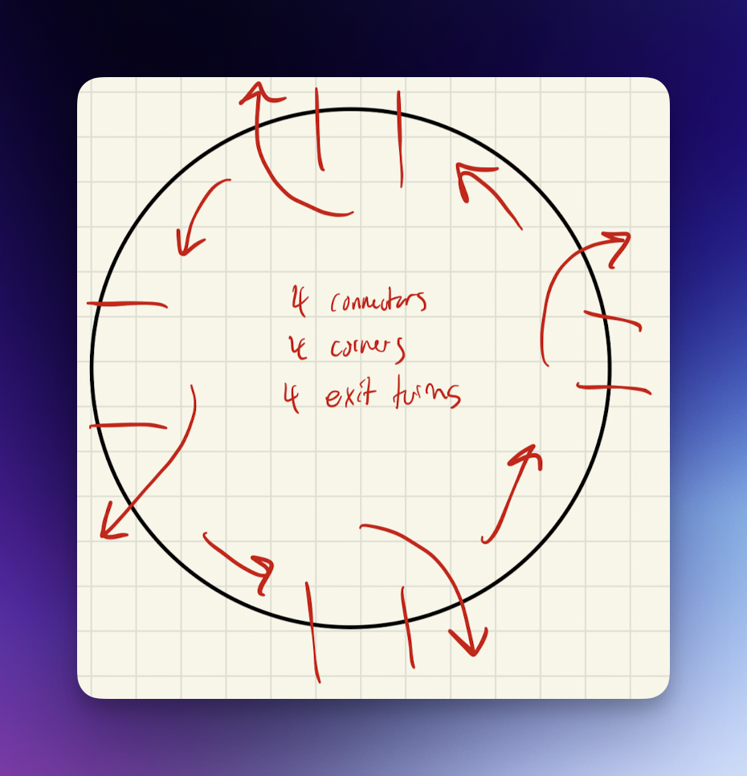
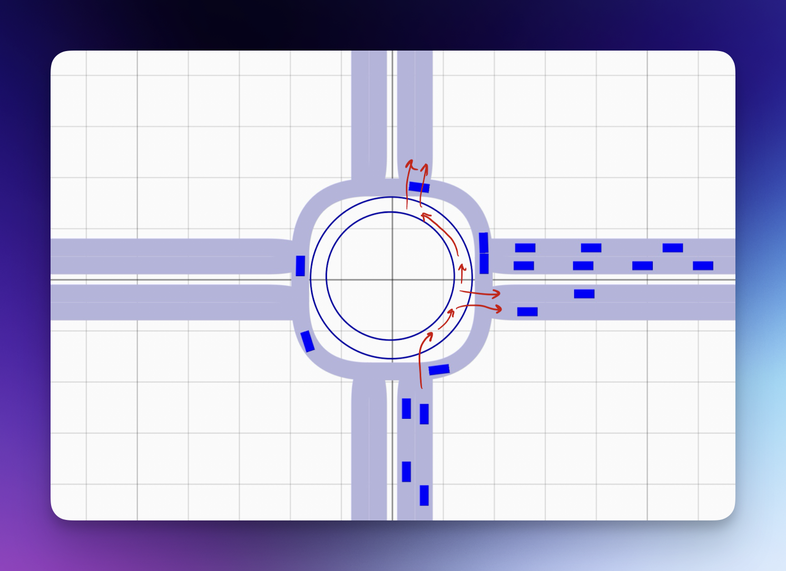
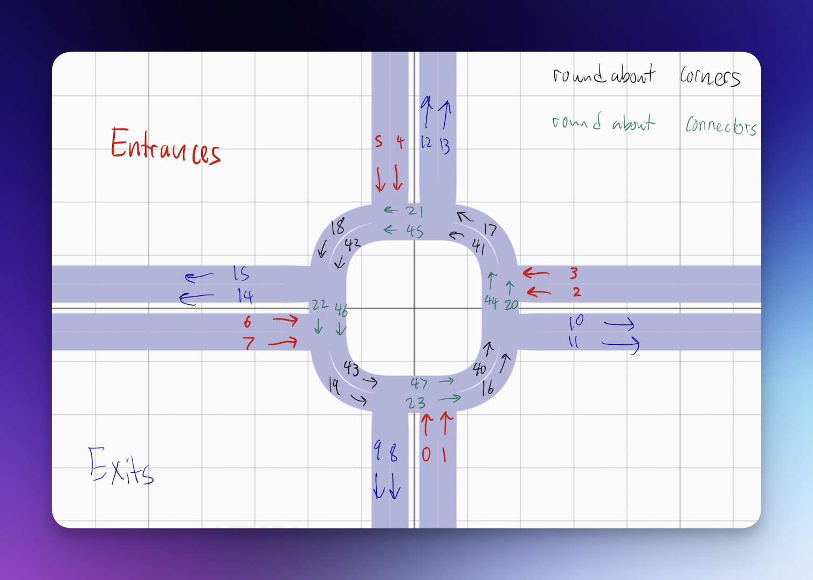
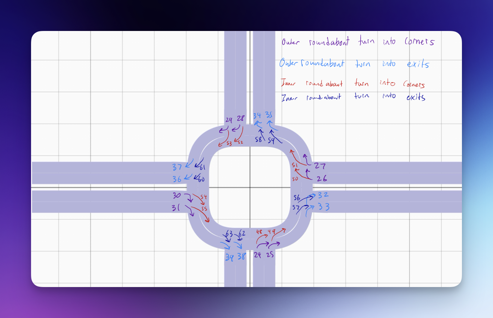

<!-- Improved compatibility of back to top link: See: https://github.com/othneildrew/Best-README-Template/pull/73 -->
<a name="readme-top"></a>

<!-- PROJECT SHIELDS -->
<!--
*** I'm using markdown "reference style" links for readability.
*** Reference links are enclosed in brackets [ ] instead of parentheses ( ).
*** See the bottom of this document for the declaration of the reference variables
*** for contributors-url, forks-url, etc. This is an optional, concise syntax you may use.
*** https://www.markdownguide.org/basic-syntax/#reference-style-links
-->


# 2PX3 Sprint 2 Simulation Code
This repository has been modified based on the original code for the purposes of analyzing and optimizing traffic flow for the 2PX3 course.
<!-- PROJECT LOGO -->
<div align="center">
  <h3 align="center">trafficSimulator</h3>

  <p align="center">
    A microscopic traffic simulator in Python. Simulation code for 2PX3 Sprint 2.
  </p>
</div>


<!-- ABOUT THE PROJECT -->
## About The Project

**trafficSimulator** is a Python project that aims to provide a flexible and user-friendly platform for creating and testing traffic scenarios and analyzing their outcomes.

**trafficSimulator** is suitable for students, researchers and practitioners who are interested in studying traffic phenomena and finding solutions for traffic problems.

To learn more about how the project was created check out this [article](https://towardsdatascience.com/simulating-traffic-flow-in-python-ee1eab4dd20f) on Medium.

### Design Process

Our prototype design was developed through a systematic approach:

1. **Analysis**: We first analyzed the given roundabout code and traced the movement paths of vehicles while making note of segment numbers.



2. **Planning**: We designed our intersection with the main objective of reducing traffic congestion.




3. **Implementation**: We expanded the number of lanes for entry and exit to allow for more vehicles, and implemented a dual-lane roundabout design.



4. **Finalization**: We labeled each segment with its number to facilitate further development and vehicle generation.




<p align="right">(<a href="#readme-top">back to top</a>)</p>


### Built With

* [![Python][Python]][Python-url]
* [![Numpy][Numpy]][Numpy-url]
* [![Scipy][Scipy]][Scipy-url]
* [![Dear PyGui][DearPyGui]][DearPyGui-url]

### Based on:
* Treiber, Martin; Hennecke, Ansgar; Helbing, Dirk (2000),<br>"**Congested traffic states in empirical observations and microscopic simulations**", Physical Review E, 62 (2): 1805–1824, [arXiv:cond-mat/0002177](https://arxiv.org/abs/cond-mat/0002177), [Bibcode:2000PhRvE..62.1805T](https://ui.adsabs.harvard.edu/abs/2000PhRvE..62.1805T), [doi:10.1103/PhysRevE.62.1805](https://doi.org/10.1103%2FPhysRevE.62.1805), [PMID 11088643](https://pubmed.ncbi.nlm.nih.gov/11088643), [S2CID 1100293](https://api.semanticscholar.org/CorpusID:1100293)

<p align="right">(<a href="#readme-top">back to top</a>)</p>


<!-- GETTING STARTED -->
## Getting Started

### Prerequisites

Requires Python 3.7+.

### Installation

#### Using PIP
```sh
pip install trafficSimulator
```

#### Installing from source
1. `git clone https://github.com/PakmanGames/traffic_simulation`
2. `cd trafficSimulator`
3. `pip install -e .`

<p align="right">(<a href="#readme-top">back to top</a>)</p>


<!-- USAGE EXAMPLES -->
## Usage

You can import the module using:
```python
import trafficSimulator as ts
```

_For more examples, please refer to the [Examples](https://github.com/BilHim/trafficSimulator/tree/main/examples) folder._


<!-- CONTRIBUTING -->
## Contributing

Check out the [Contribution Guidelines](https://github.com/BilHim/trafficSimulator/blob/main/CONTRIBUTING.md).

If you have a suggestion that would make this better, please fork the repo and create a pull request. You can also simply open an issue with the tag "enhancement".
Don't forget to give the project a star! Thanks again!

1. Fork the Project
2. Create your Feature Branch (`git checkout -b feature/AmazingFeature`)
3. Commit your Changes (`git commit -m 'Add some AmazingFeature'`)
4. Push to the Branch (`git push origin feature/AmazingFeature`)
5. Open a Pull Request

<p align="right">(<a href="#readme-top">back to top</a>)</p>


<!-- LICENSE -->
## License

Distributed under the MIT License. See [`LICENSE`](https://github.com/BilHim/trafficSimulator/blob/main/LICENSE) for more information.

<p align="right">(<a href="#readme-top">back to top</a>)</p>


<!-- CONTACT -->
## Links
Original Project Link: [https://github.com/BilHim/trafficSimulator](https://github.com/BilHim/trafficSimulator)
<div align="center">

[![Forks][forks-shield]][forks-url]
[![Stargazers][stars-shield]][stars-url]
[![Issues][issues-shield]][issues-url]
[![MIT License][license-shield]][license-url]

</div>
<p align="right">(<a href="#readme-top">back to top</a>)</p>


<!-- MARKDOWN LINKS & IMAGES -->
<!-- https://www.markdownguide.org/basic-syntax/#reference-style-links -->
[contributors-shield]: https://img.shields.io/github/contributors/BilHim/trafficSimulator.svg?style=for-the-badge
[contributors-url]: https://github.com/BilHim/trafficSimulator/graphs/contributors
[forks-shield]: https://img.shields.io/github/forks/BilHim/trafficSimulator.svg?style=for-the-badge
[forks-url]: https://github.com/BilHim/trafficSimulator/forks
[stars-shield]: https://img.shields.io/github/stars/BilHim/trafficSimulator.svg?style=for-the-badge
[stars-url]: https://github.com/BilHim/trafficSimulator/stargazers
[issues-shield]: https://img.shields.io/github/issues/BilHim/trafficSimulator.svg?style=for-the-badge
[issues-url]: https://github.com/othneildrew/Best-README-Template/issues
[license-shield]: https://img.shields.io/github/license/BilHim/trafficSimulator.svg?style=for-the-badge
[license-url]: https://github.com/BilHim/trafficSimulator/blob/master/LICENSE
[linkedin-shield]: https://img.shields.io/badge/-LinkedIn-black.svg?style=for-the-badge&logo=linkedin&colorB=555
[linkedin-url]: https://www.linkedin.com/in/bilalhimite/
[product-screenshot]: images/screenshot-1.png

[Python]: https://img.shields.io/badge/python-306998?style=for-the-badge&logo=python&logoColor=white
[Python-url]: https://www.python.org/

[Numpy]: https://img.shields.io/badge/numpy-4b73c9?style=for-the-badge&logo=numpy&logoColor=white
[Numpy-url]: https://numpy.org/

[Scipy]: https://img.shields.io/badge/scipy-0054a6?style=for-the-badge&logo=scipy&logoColor=white
[Scipy-url]: https://scipy.org/

[DearPyGui]: https://img.shields.io/badge/DearPyGUI-306998?style=for-the-badge
[DearPyGui-url]: https://github.com/hoffstadt/DearPyGui
